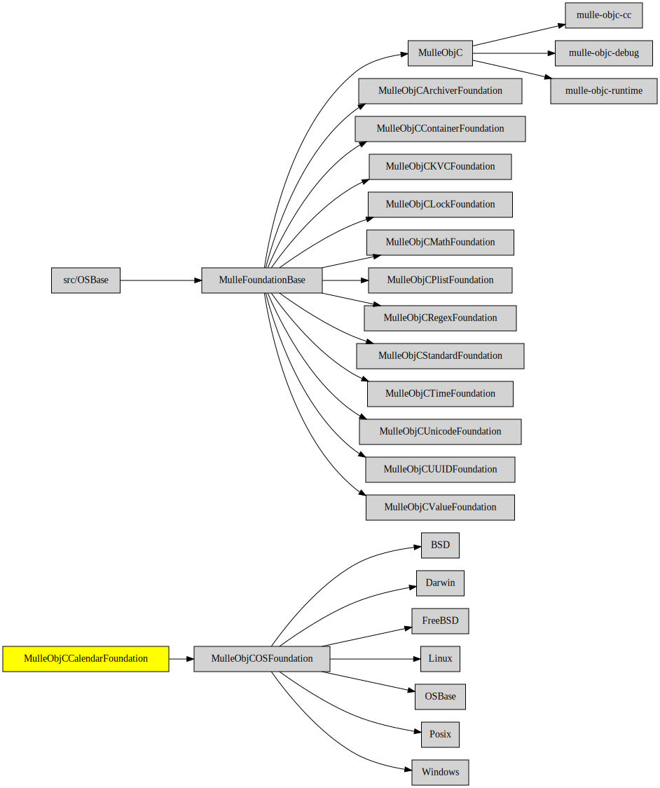

# MulleObjCCalendarFoundation

#### 📆 Calendar class NSCalendar

Adds a Gregorian and a Julian `NSCalendar` to the [MulleFoundation](//github.com/MulleFoundation).


| Release Version                                       | Release Notes  | AI Documentation
|-------------------------------------------------------|----------------|---------------
|  [](//github.com/MulleFoundation/MulleObjCCalendarFoundation/actions) | [RELEASENOTES](RELEASENOTES.md) | [DeepWiki for MulleObjCCalendarFoundation](https://deepwiki.com/MulleFoundation/MulleObjCCalendarFoundation)


## API

| Class               | Description
|---------------------|-----------------------
| `NSCalendar`        |
| `NSDateComponents`  |


## Requirements

|   Requirement         | Release Version  | Description
|-----------------------|------------------|---------------
| [MulleObjCOSFoundation](https://github.com/MulleFoundation/MulleObjCOSFoundation) |  [](https://github.com/MulleFoundation/MulleObjCOSFoundation/actions/workflows/mulle-sde-ci.yml) | 💻 Platform-dependent classes and categories like NSTask, NSPipe
| [mulle-objc-list](https://github.com/mulle-objc/mulle-objc-list) |  [](https://github.com/mulle-objc/mulle-objc-list/actions/workflows/mulle-sde-ci.yml) | 📒 Lists mulle-objc runtime information contained in executables.

### You are here



## Add

Use [mulle-sde](//github.com/mulle-sde) to add MulleObjCCalendarFoundation to your project:

``` sh
mulle-sde add github:MulleFoundation/MulleObjCCalendarFoundation
```

## Install

Use [mulle-sde](//github.com/mulle-sde) to build and install MulleObjCCalendarFoundation and all dependencies:

``` sh
mulle-sde install --prefix /usr/local \
   https://github.com/MulleFoundation/MulleObjCCalendarFoundation/archive/latest.tar.gz
```

### Legacy Installation

Install the requirements:

| Requirements                                 | Description
|----------------------------------------------|-----------------------
| [MulleObjCOSFoundation](https://github.com/MulleFoundation/MulleObjCOSFoundation)             | 💻 Platform-dependent classes and categories like NSTask, NSPipe
| [mulle-objc-list](https://github.com/mulle-objc/mulle-objc-list)             | 📒 Lists mulle-objc runtime information contained in executables.

Download the latest [tar](https://github.com/MulleFoundation/MulleObjCCalendarFoundation/archive/refs/tags/latest.tar.gz) or [zip](https://github.com/MulleFoundation/MulleObjCCalendarFoundation/archive/refs/tags/latest.zip) archive and unpack it.

Install **MulleObjCCalendarFoundation** into `/usr/local` with [cmake](https://cmake.org):

``` sh
cmake -B build \
      -DCMAKE_INSTALL_PREFIX=/usr/local \
      -DCMAKE_PREFIX_PATH=/usr/local \
      -DCMAKE_BUILD_TYPE=Release &&
cmake --build build --config Release &&
cmake --install build --config Release
```

## Author

[Nat!](https://mulle-kybernetik.com/weblog) for Mulle kybernetiK  


